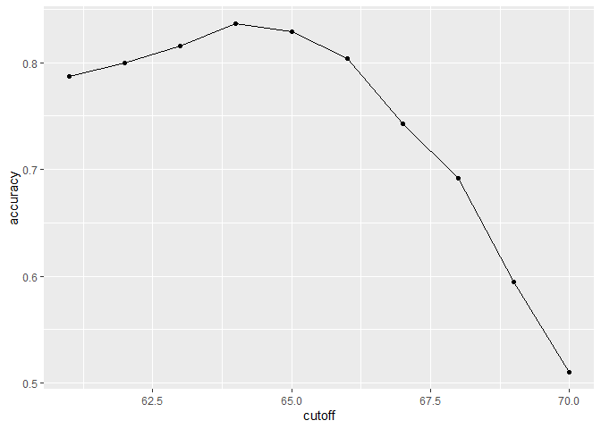

## Setup

```r
knitr::opts_chunk$set(echo = TRUE)

# Required Packages
library(tidyverse)
library(caret)
library(dslabs)
data(heights)

# Setting the seed
set.seed(2, sample.kind = "Rounding")
```

# Basics of Evaluating Machine Learning Algorithms

### Predicting Sex based on Height


```r
# Defining outcomes and predictors
y <- heights$sex
x <- heights$height

# Generate training and test sets
test_index <- createDataPartition(y, times = 1, p = 0.5, list = FALSE)
test_set <- heights[test_index, ]
train_set <- heights[-test_index, ]
```

We will build two algorithms determine the proportion of cases that were correctly predicted (overall accuracy).


```r
# This algorithm simply guesses the sex
y_hat <- sample(c("Male", "Female"), length(test_index), replace = TRUE)
y_hat <- sample(c("Male", "Female"), length(test_index), replace = TRUE) %>% 
  factor(levels = levels(test_set$sex))

# Accuracy of guessing
mean(y_hat == test_set$sex)
```

```
## [1] 0.5238095
```


```r
# Algorithm that predicts using standard deviation
heights %>% group_by(sex) %>% summarize(mean(height), sd(height))
```

```
## # A tibble: 2 x 3
##   sex    `mean(height)` `sd(height)`
## * <fct>           <dbl>        <dbl>
## 1 Female           64.9         3.76
## 2 Male             69.3         3.61
```

```r
y_hat <- ifelse(x > 62, "Male", "Female") %>% factor(levels = levels(test_set$sex))
mean(y == y_hat)
```

```
## [1] 0.7933333
```
More accurate, but we can do better by examining other cutoff values. We can do this by calculating the overall accuracy of varying cutoffs and picking the best result.


```r
# examine the accuracy of 10 cutoffs
cutoff <- seq(61, 70)
accuracy <- map_dbl(cutoff, function(x){
  y_hat <- ifelse(train_set$height > x, "Male", "Female") %>% 
    factor(levels = levels(test_set$sex))
  mean(y_hat == train_set$sex)
})

# and now plot the accuracy
data.frame(cutoff, accuracy) %>% 
  ggplot(aes(cutoff, accuracy)) + 
  geom_point() + 
  geom_line() 
```

<!-- -->

```r
max(accuracy)
```

```
## [1] 0.8361905
```

```r
# the max accuracy has the cutoff value of:
best_cutoff <- cutoff[which.max(accuracy)]
best_cutoff
```

```
## [1] 64
```


We can see the max accuracy value is 0.836 (with a cutoff value of 64 inches), much higher than the 50% we were getting from guessing.

Finally we can test this cutoff on the test set to make sure the accuracy is not overly optimistic, and the accuracy is not caused by overfitting.


```r
y_hat <- ifelse(test_set$height > best_cutoff, "Male", "Female") %>% 
  factor(levels = levels(test_set$sex))
y_hat <- factor(y_hat)
mean(y_hat == test_set$sex)
```

```
## [1] 0.8171429
```


