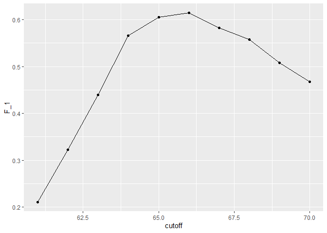
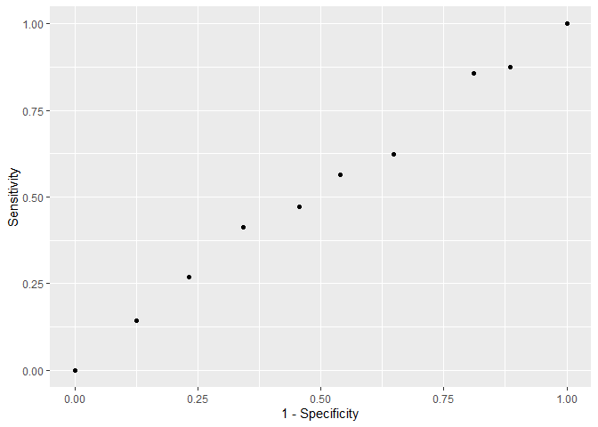
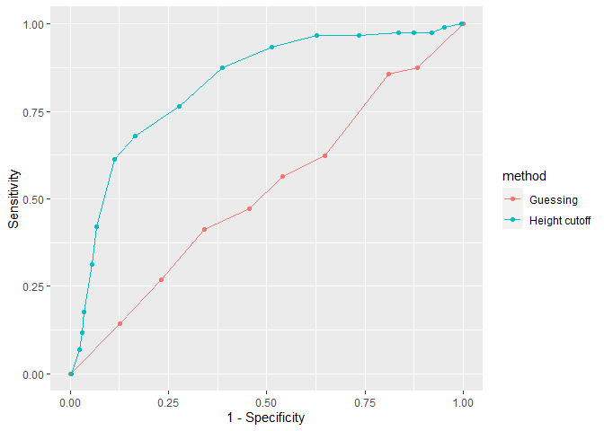
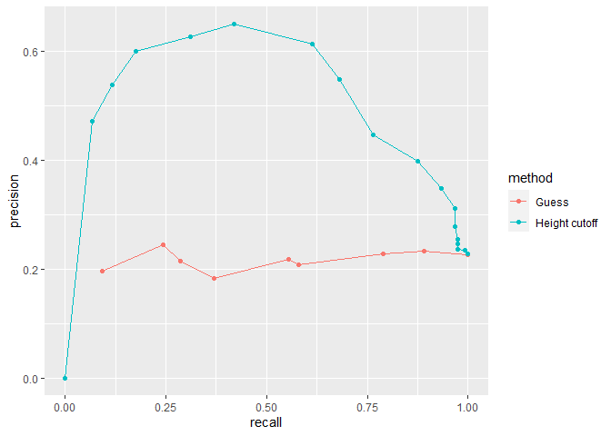
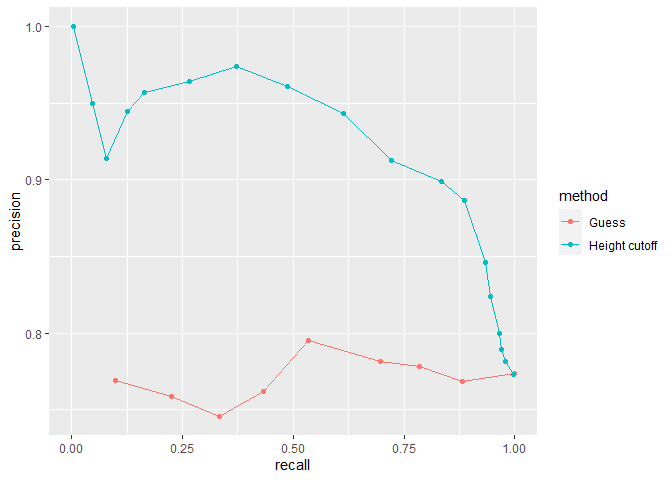

## Setup

```r
knitr::opts_chunk$set(echo = TRUE)

# Required Packages
library(tidyverse)
library(caret)
library(dslabs)
library(ggrepel)
data(heights)

# Setting the seed
set.seed(2, sample.kind="Rounding")
```

# Basics of Evaluating Machine Learning Algorithms

### Predicting Sex based on Height


```r
# Defining outcomes and predictors
y <- heights$sex
x <- heights$height

# Generate training and test sets
test_index <- createDataPartition(y, times = 1, p = 0.5, list = FALSE)
test_set <- heights[test_index, ]
train_set <- heights[-test_index, ]
```

We will build two algorithms determine the proportion of cases that were correctly predicted (overall accuracy).


```r
# This algorithm simply guesses the sex
y_hat <- sample(c("Male", "Female"), length(test_index), replace = TRUE)
y_hat <- sample(c("Male", "Female"), length(test_index), replace = TRUE) %>% 
  factor(levels = levels(test_set$sex))

# Accuracy of guessing
mean(y_hat == test_set$sex)
```

```
## [1] 0.5238095
```


```r
# Algorithm that predicts using standard deviation
heights %>% group_by(sex) %>% summarize(mean(height), sd(height))
```

```
## # A tibble: 2 x 3
##   sex    `mean(height)` `sd(height)`
## * <fct>           <dbl>        <dbl>
## 1 Female           64.9         3.76
## 2 Male             69.3         3.61
```

```r
y_hat <- ifelse(x > 62, "Male", "Female") %>% factor(levels = levels(test_set$sex))
mean(y == y_hat)
```

```
## [1] 0.7933333
```
More accurate, but we can do better by examining other cutoff values. We can do this by calculating the overall accuracy of varying cutoffs and picking the best result.


```r
# examine the accuracy of 10 cutoffs
cutoff <- seq(61, 70)
accuracy <- map_dbl(cutoff, function(x){
  y_hat <- ifelse(train_set$height > x, "Male", "Female") %>% 
    factor(levels = levels(test_set$sex))
  mean(y_hat == train_set$sex)
})

# and now plot the accuracy
data.frame(cutoff, accuracy) %>% 
  ggplot(aes(cutoff, accuracy)) + 
  geom_point() + 
  geom_line() 
```

<!-- -->

```r
max(accuracy)
```

```
## [1] 0.8361905
```

```r
# the max accuracy has the cutoff value of:
best_cutoff <- cutoff[which.max(accuracy)]
best_cutoff
```

```
## [1] 64
```


We can see the max accuracy value is 0.836 (with a cutoff value of 64 inches), much higher than the 50% we were getting from guessing.

Finally we can test this cutoff on the test set to make sure the accuracy is not overly optimistic, and the accuracy is not caused by overfitting.


```r
y_hat <- ifelse(test_set$height > best_cutoff, "Male", "Female") %>% 
  factor(levels = levels(test_set$sex))
y_hat <- factor(y_hat)
mean(y_hat == test_set$sex)
```

```
## [1] 0.8171429
```

### Confusion Matrix

One issue is quickly made apparent when we tabulate the combination of prediction and actual value:


```r
# tabulate each combination of prediction and actual value
table(predicted = y_hat, actual = test_set$sex)
```

```
##          actual
## predicted Female Male
##    Female     50   27
##    Male       69  379
```

```r
test_set %>% 
  mutate(y_hat = y_hat) %>%
  group_by(sex) %>% 
  summarize(accuracy = mean(y_hat == sex))
```

```
## # A tibble: 2 x 2
##   sex    accuracy
## * <fct>     <dbl>
## 1 Female    0.420
## 2 Male      0.933
```

As we can see, our success rate is far higher when guessing males. This is caused by prevalence. We simply have more males in the data. Our training data is biased, so our algorithm is also biased.


```r
confusionMatrix(data = y_hat, reference = test_set$sex)
```

```
## Confusion Matrix and Statistics
## 
##           Reference
## Prediction Female Male
##     Female     50   27
##     Male       69  379
##                                           
##                Accuracy : 0.8171          
##                  95% CI : (0.7814, 0.8493)
##     No Information Rate : 0.7733          
##     P-Value [Acc > NIR] : 0.008354        
##                                           
##                   Kappa : 0.4041          
##                                           
##  Mcnemar's Test P-Value : 2.857e-05       
##                                           
##             Sensitivity : 0.42017         
##             Specificity : 0.93350         
##          Pos Pred Value : 0.64935         
##          Neg Pred Value : 0.84598         
##              Prevalence : 0.22667         
##          Detection Rate : 0.09524         
##    Detection Prevalence : 0.14667         
##       Balanced Accuracy : 0.67683         
##                                           
##        'Positive' Class : Female          
## 
```
A general improvement to using overall accuracy is to study sensitivity and specificity separately. Sensitivity, also known as the true positive rate or recall, is the proportion of actual positive outcomes correctly identified as such. Specificity, also known as the true negative rate, is the proportion of actual negative outcomes that are correctly identified as such.

| Measure of | Name 1 | Name 2 | Definition | Probability representation |
|---------|-----|----------|--------|------------------|
sensitivity | True Positive Rate (TPR) | Recall | $\frac{\mbox{TP}}{\mbox{TP} + \mbox{FN}}$ | $\mbox{Pr}(\hat{Y}=1 \mid Y=1)$ |
specificity | True Negative Rate (TNR) | 1-FPR | $\frac{\mbox{TN}}{\mbox{TN}+\mbox{FP}}$ | $\mbox{Pr}(\hat{Y}=0 \mid Y=0)$ |
specificity |  Positive Predictive Value (PPV) | Precision | $\frac{\mbox{TP}}{\mbox{TP}+\mbox{FP}}$ | $\mbox{Pr}(Y=1 \mid \hat{Y}=1)$|

###  Balanced accuracy and F1 score

For optimization purposes, sometimes it is more useful to have a one number summary than studying both specificity and sensitivity. One preferred metric is balanced accuracy. Because specificity and sensitivity are rates, it is more appropriate to compute the harmonic average. In fact, the F1-score, a widely used one-number summary, is the harmonic average of precision and recall. 

$$
F_1 =\frac{1}{\frac{1}{2}\left(\frac{1}{\mbox{recall}} + 
    \frac{1}{\mbox{precision}}\right) }
$$

Depending on the context, some type of errors are more costly than others. The F1-score can be adapted to weigh specificity and sensitivity differently by using $\beta$ to represent how much more important sensitivity is compared to specificity:

$$
\frac{1}{\frac{\beta^2}{1+\beta^2}\frac{1}{\mbox{recall}} + 
    \frac{1}{1+\beta^2}\frac{1}{\mbox{precision}} }
$$

We can rebuild our prediction algorithm, except this time maximizing the F-score over the overall accuracy. 


```r
# maximize F-score
cutoff <- seq(61, 70)
F_1 <- map_dbl(cutoff, function(x){
  y_hat <- ifelse(train_set$height > x, "Male", "Female") %>% 
    factor(levels = levels(test_set$sex))
  F_meas(data = y_hat, reference = factor(train_set$sex))
})

data.frame(cutoff, F_1) %>% 
  ggplot(aes(cutoff, F_1)) + 
  geom_point() + 
  geom_line()
```

<!-- -->

```r
max(F_1)
```

```
## [1] 0.6142322
```

```r
best_cutoff <- cutoff[which.max(F_1)]
best_cutoff
```

```
## [1] 66
```

```r
y_hat <- ifelse(test_set$height > best_cutoff, "Male", "Female") %>% 
  factor(levels = levels(test_set$sex))
sensitivity(data = y_hat, reference = test_set$sex)
```

```
## [1] 0.6806723
```

```r
specificity(data = y_hat, reference = test_set$sex)
```

```
## [1] 0.8349754
```

As we can see, our algorithm is maximized with a cutoff at 66 inches. This not only increases our odds of guessing correctly, but also ensure specificity and sensitivity are also relatively high.

### ROC and precision-recall curves

A very common approach to evaluating accuracy and F1-score is to compare them graphically by plotting both. A widely used plot that does this is the receiver operating characteristic (ROC) curve. The ROC curve plots sensitivity (TPR) versus 1 - specificity or the false positive rate (FPR).


```r
# Even just guessing male 90% of the time greatly increases our accuracy
# This doesn't necessarily mean our algorithm is accurate.
p <- 0.9
n <- length(test_index)
y_hat <- sample(c("Male", "Female"), n, replace = TRUE, prob=c(p, 1-p)) %>% 
  factor(levels = levels(test_set$sex))
mean(y_hat == test_set$sex)
```

```
## [1] 0.7180952
```

```r
# ROC curve
probs <- seq(0, 1, length.out = 10)
guessing <- map_df(probs, function(p){
  y_hat <- 
    sample(c("Male", "Female"), n, replace = TRUE, prob=c(p, 1-p)) %>% 
    factor(levels = c("Female", "Male"))
  list(method = "Guessing",
       FPR = 1 - specificity(y_hat, test_set$sex),
       TPR = sensitivity(y_hat, test_set$sex))
})
guessing %>% qplot(FPR, TPR, data =., xlab = "1 - Specificity", ylab = "Sensitivity")
```

<!-- -->

```r
cutoffs <- c(50, seq(60, 75), 80)
height_cutoff <- map_df(cutoffs, function(x){
  y_hat <- ifelse(test_set$height > x, "Male", "Female") %>% 
    factor(levels = c("Female", "Male"))
   list(method = "Height cutoff",
        FPR = 1-specificity(y_hat, test_set$sex),
        TPR = sensitivity(y_hat, test_set$sex))
})

# plot both curves together
bind_rows(guessing, height_cutoff) %>%
  ggplot(aes(FPR, TPR, color = method)) +
  geom_line() +
  geom_point() +
  xlab("1 - Specificity") +
  ylab("Sensitivity")
```

<!-- -->

```r
map_df(cutoffs, function(x){
  y_hat <- ifelse(test_set$height > x, "Male", "Female") %>% 
    factor(levels = c("Female", "Male"))
   list(method = "Height cutoff",
        cutoff = x, 
        FPR = 1-specificity(y_hat, test_set$sex),
        TPR = sensitivity(y_hat, test_set$sex))
}) %>%
  ggplot(aes(FPR, TPR, label = cutoff)) +
  geom_line() +
  geom_point() +
  geom_text_repel(nudge_x = 0.01, nudge_y = -0.01)
```

<!-- -->

ROC curves have one weakness and it is that neither of the measures plotted depend on prevalence. In cases in which prevalence matters, we may instead make a precision-recall plot, which has a similar idea with ROC curve.


```r
# plot precision against recall
guessing <- map_df(probs, function(p){
  y_hat <- sample(c("Male", "Female"), length(test_index), 
                  replace = TRUE, prob=c(p, 1-p)) %>% 
    factor(levels = c("Female", "Male"))
  list(method = "Guess",
    recall = sensitivity(y_hat, test_set$sex),
    precision = precision(y_hat, test_set$sex))
})

height_cutoff <- map_df(cutoffs, function(x){
  y_hat <- ifelse(test_set$height > x, "Male", "Female") %>% 
    factor(levels = c("Female", "Male"))
  list(method = "Height cutoff",
       recall = sensitivity(y_hat, test_set$sex),
    precision = precision(y_hat, test_set$sex))
})

bind_rows(guessing, height_cutoff) %>%
  ggplot(aes(recall, precision, color = method)) +
  geom_line() +
  geom_point()
```

<!-- -->

```r
guessing <- map_df(probs, function(p){
  y_hat <- sample(c("Male", "Female"), length(test_index), replace = TRUE, 
                  prob=c(p, 1-p)) %>% 
    factor(levels = c("Male", "Female"))
  list(method = "Guess",
    recall = sensitivity(y_hat, relevel(test_set$sex, "Male", "Female")),
    precision = precision(y_hat, relevel(test_set$sex, "Male", "Female")))
})

height_cutoff <- map_df(cutoffs, function(x){
  y_hat <- ifelse(test_set$height > x, "Male", "Female") %>% 
    factor(levels = c("Male", "Female"))
  list(method = "Height cutoff",
       recall = sensitivity(y_hat, relevel(test_set$sex, "Male", "Female")),
    precision = precision(y_hat, relevel(test_set$sex, "Male", "Female")))
})
bind_rows(guessing, height_cutoff) %>%
  ggplot(aes(recall, precision, color = method)) +
  geom_line() +
  geom_point()
```

<!-- -->

